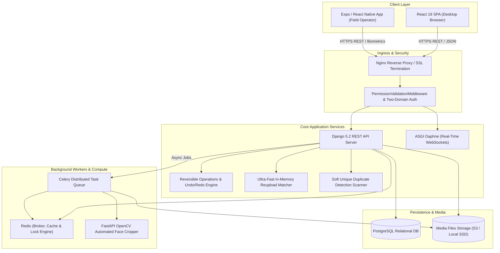

<p align="center">
  
</p>


<p align="center">
  <a href="https://panel.adarshbhopal.in"></a>
  <a href="https://www.djangoproject.com/"></a>
  <a href="https://react.dev/"></a>
  <a href="https://vitejs.dev/"></a>
  <a href="https://reactnative.dev/"></a>
  <a href="https://opencv.org/"></a>
</p>

<p align="center">
  <strong>High-performance, production-grade enterprise ID card lifecycle & identity operations platform.</strong><br/>
  Engineered for schools, universities, multi-branch colleges, institutions, and high-volume commercial printing labs.
</p>

<p align="center">
  <a href="https://panel.adarshbhopal.in">🌐 <b>Live Production Panel</b></a> •
  <a href="docs/DESKTOP_PORTAL_GUIDE.md">🖥️ <b>Desktop Portal Guide</b></a> •
  <a href="docs/WEB_APP_INTEGRATION.md">🔗 <b>Web App API</b></a> •
  <a href="docs/SYSTEM_ARCHITECTURE.md">🏗️ <b>Architecture</b></a> •
  <a href="docs/FEATURES_AND_WORKFLOWS.md">⚡ <b>Workflows</b></a> •
  <a href="docs/BULK_INGESTION_AND_EXPORTS.md">📥 <b>Bulk Ingestion</b></a> •
  <a href="docs/MOBILE_APP_COMPANION.md">📱 <b>Mobile Companion</b></a> •
  <a href="docs/VERSION_LOG.md">📝 <b>Release Log</b></a>
</p>

---

## 📊 Platform Telemetry & Performance Benchmarks

| Capability | Metric / Benchmark | Architectural Implementation |
|---|---|---|
| ⚡ **Bulk Ingestion Speed** | **10,000+ images in <400ms** | In-memory pre-indexed streaming matcher (`UltraFastReuploadMatcher`) |
| 🔄 **Data Integrity & Reversibility** | **100% Non-Destructive Undo/Redo** | Dual-layer audit engine (`OperationHistory` + `BulkTransaction` inverse execution) |
| 🛡️ **Multi-Tenant Security** | **Two-Domain Isolation** | Platform Domain vs. Organisation Domain with explicit table delegation (`TableAccess`) |
| 🔍 **Constraint Checking** | **Soft Unique Duplicate Scanner** | Real-time backend scanner (`find_duplicate_cards`) without data loss or record mutation |
| 🎯 **Biometric Processing** | **Real-Time Optical Feedback** | Standalone OpenCV face cropper + React Native camera eye/glasses alignment engine |
| 🖥️ **UI Render Speed** | **60 FPS Virtualized Grid** | TanStack Virtual row virtualization rendering 10,000+ cards with zero DOM latency |
| 🖨️ **Print Resolution Accuracy** | **0.01mm Grid Alignment** | ReportLab & WeasyPrint vector rendering engines with custom bleed & trim marks |

---

## 🌟 Feature Showcase & Visual Modules

CardFlow brings together web management, real-time biometrics, dynamic template engines, automated export pipelines, and granular multi-tenant access control. Below is an interactive overview of each core platform module:

---

### 🏛️ 1. Two-Domain Role Architecture & Organisation Manager Delegation

**Overview & Key Capabilities:**
- **Two-Domain Separation**:
  - **Platform Domain**: `Prime Admin` (Platform Owner) $\rightarrow$ `Super Admin` $\rightarrow$ `Operator` / `Photographer`.
  - **Organisation Domain**: `Organisation` $\rightarrow$ `Prime Manager` (1, Org Owner) + `Super Managers` (0..N, configurable cap, default 4) + `Guest Manager` + `Assistants`.
- **Autonomous Super Managers**: Independent user accounts with separate credentials and login sessions. Super Managers are strictly forbidden from creating tables (`403 Forbidden`) and can only view/edit cards for tables delegated to them.
- **Relational Table Delegation (`TableAccess`)**: Prime Managers delegate table workload to Super Managers via an interactive modal in real time.
- **Scoped Assistants**: Assistants are owned by their specific creating Manager (`assistant.manager_id = user.id`) and restricted to that Manager's delegated tables.
- **Auto-Generated Temporary Passwords (PIN)**: Automatically generates 8–10 character PINs (e.g. `MATH@5080`) based on entity name or phone, supporting dual Email/Username login.

<table width="100%">
  <tr>
    <td width="50%" align="center">
      
      <br/><sub><b>Multi-Tenant Institution Management Dashboard</b></sub>
    </td>
    <td width="50%" align="center">
      
      <br/><sub><b>Dynamic Card Schema & Field Design Lab</b></sub>
    </td>
  </tr>
  <tr>
    <td width="50%" align="center">
      
      <br/><sub><b>Client Dashboard & Operations Telemetry</b></sub>
    </td>
    <td width="50%" align="center">
      
      <br/><sub><b>Card Data Table & Real-Time Search Filters</b></sub>
    </td>
  </tr>
</table>

---

### 📱 2. Mobile Companion App & Real-Time Biometric Scanner

**Overview & Key Capabilities:**
- **Cross-Platform React Native App**: Mobile companion app for field operators, photographers, and school staff with native SVG icon rendering (zero startup crashes).
- **Real-Time Optical Camera Biometrics**: Embedded camera scanner checks face presence, eye alignment, and detects optical glasses or sunglasses in real time with color-coded status feedback (Green / Amber / Red).
- **Directory & Profile Management**: Search student records on the move, capture missing photos, and inspect student card previews directly from mobile devices.

<table width="100%">
  <tr>
    <td width="50%" align="center">
      
      <br/><sub><b>Mobile Home Screen & Role-Based Actions</b></sub>
    </td>
    <td width="50%" align="center">
      
      <br/><sub><b>Real-Time Optical Camera Biometrics Scanner</b></sub>
    </td>
  </tr>
  <tr>
    <td width="50%" align="center">
      
      <br/><sub><b>Mobile Student & Staff Directory</b></sub>
    </td>
    <td width="50%" align="center">
      
      <br/><sub><b>Student Profile & Media Detail View</b></sub>
    </td>
  </tr>
</table>

---

### 🖨️ 3. Printing, Production Pools & Dedicated 3-Step Reprint Lifecycle

**Overview & Key Capabilities:**
- **State-Machine Status Pipeline**: Cards transition seamlessly through `pending ➔ verified ➔ pool ➔ approved ➔ download` to guarantee print quality.
- **Dedicated 3-Step Reprint Lifecycle (`backend/reprint/`)**:
  - **Reprint List**: Source pool strictly populated with downloaded cards (deduplicated by `card.id`) with pre-request inline student editing.
  - **Requested List**: Review staged edits diffs, reject/cancel back to reprint pool, or confirm.
  - **Confirmed List**: In-place non-duplicating card mutations directly on original records with sequential `#1`, `#2` reprint count badges.
- **Web App Public API Synchronization (`backend/web_app/`)**: Server-to-server authenticated endpoint (`/api/web/clients/` via `X-API-KEY`) providing live client directories and aggregate student card statistics to public landing websites.
- **Batch Print Job Tracking**: Group card orders into production print pools with real-time status badges and instant QR code verification.

<table width="100%">
  <tr>
    <td width="50%" align="center">
      
      <br/><sub><b>Reprint Request Approval & Status Queue</b></sub>
    </td>
    <td width="50%" align="center">
      
      <br/><sub><b>Status Pipeline (Pending ➔ Approved ➔ Pool)</b></sub>
    </td>
  </tr>
  <tr>
    <td width="50%" align="center">
      
      <br/><sub><b>Batch Production Print Job Tracking</b></sub>
    </td>
    <td width="50%" align="center">
      
      <br/><sub><b>Instant QR Code & Digital Verification</b></sub>
    </td>
  </tr>
</table>

---

### ⚡ 4. Bulk Ingestion, OpenCV Face Cropper & Export Engine

**Overview & Key Capabilities:**
- **Automated OpenCV Face Cropper**: Standalone FastAPI + PyInstaller service automatically detects portraits, centers heads, and crops to exact ID card aspect ratios (3:4 portrait).
- **Semantic ZIP & Excel Ingestion**: Bulk upload thousands of student records via Excel/CSV and automatically match multi-field ZIP archives (`PHOTO`, `SIGNATURE`, `FATHER`, `MOTHER`, `QR`).
- **High-Precision PDF & Word Exporters**: Export print-ready PDF grid sheets (ReportLab / WeasyPrint) with millimeter accuracy, or Word (`.docx`) documents with custom Class & Section page breaks.

<table width="100%">
  <tr>
    <td width="50%" align="center">
      
      <br/><sub><b>Automated OpenCV Face Cropping Engine</b></sub>
    </td>
    <td width="50%" align="center">
      
      <br/><sub><b>3D Card Lanyard & Physical Mockup Engine</b></sub>
    </td>
  </tr>
  <tr>
    <td width="50%" align="center">
      
      <br/><sub><b>Multi-Image ZIP & Excel Bulk Ingestion</b></sub>
    </td>
    <td width="50%" align="center">
      
      <br/><sub><b>PDF Grid Printing & Word (.docx) Exporters</b></sub>
    </td>
  </tr>
</table>

---

## 🏛️ System Architecture Topology



---

## 🔐 Two-Domain Role Hierarchy & Permission Matrix

| Role Key | Domain | Scope | Can Create Tables? | Can Edit Cards? | Can Approve Print? |
|---|---|---|---|---|---|
| `prime_admin` | Platform | Global Owner | ✅ Full Access | ✅ Full Access | ✅ Full Access |
| `super_admin` | Platform | Multi-Organisation Ops | ✅ Full Access | ✅ Full Access | ✅ Full Access |
| `operator` | Platform | Data Entry & Processing | ✅ Full Access | ✅ Full Access | ✅ Full Access |
| `photographer` | Platform | Media Capture Only | ❌ Forbidden | ⚠️ Media Fields Only | ❌ Forbidden |
| `prime_manager` | Organisation | Organisation Owner | ✅ Org Tables Only | ✅ Org Tables Only | ✅ Org Tables Only |
| `super_manager` | Organisation | Delegated Workload | ❌ **Forbidden (403)** | ✅ Delegated Only | ⚠️ If Delegated |
| `assistant` | Organisation | Manager-Scoped Staff | ❌ Forbidden | ✅ Delegated Only | ❌ Forbidden |
| `guest_manager` | Organisation | View / Reviewer | ❌ Forbidden | ❌ Read Only | ❌ Forbidden |

---

## 📚 In-Depth Technical Documentation

For complete technical specifications, architecture diagrams, and operational guides, explore our dedicated documentation in [`docs/`](docs/):

- 🏗️ [**System Architecture & Topology Guide**](docs/SYSTEM_ARCHITECTURE.md): Deep dive into Django 5.2, React 19 SPA, Two-Domain Hierarchy, Super Manager delegation, Daphne WebSockets, Celery task workers, and security middleware.
- 🛠️ [**Backend Architecture Specification**](docs/BACKEND_ARCHITECTURE.md): Database models (`OrganisationManager`, `TableAccess`), service layer abstractions, automated password lifecycle, and REST API route map.
- 🎨 [**Frontend Architecture Specification**](docs/FRONTEND_ARCHITECTURE.md): React 19 SPA, Vanilla CSS token engine, Manager Accounts view, `TableShareModal`, and Pro Features Manage Passwords tab.
- ⚙️ [**Core Features & Workflows Guide**](docs/FEATURES_AND_WORKFLOWS.md): Detailed workflows covering dynamic schema design, card status transitions (`pending ➔ verified ➔ pool ➔ approved`), reprint queues, and multi-tenant roles.
- ⚡ [**Bulk Ingestion, Face Cropper & Export Engine Guide**](docs/BULK_INGESTION_AND_EXPORTS.md): Complete guide to semantic image matching, standalone PyInstaller OpenCV Face Cropper, PDF grid printing, and Word `.docx` section page breaks.
- 📱 [**Mobile Companion App Guide**](docs/MOBILE_APP_COMPANION.md): Technical overview of the Expo React Native app, native SVG iconography, real-time optical biometric scanner, and Android build specs.
- 📝 [**Platform Version Log**](docs/VERSION_LOG.md): Complete chronological release history and changelog (`v5.0.0` through `v5.7.0`).

---

## 🛠️ Tech Stack Summary

| Layer | Primary Technology |
|---|---|
| **Backend Framework** | Django 5.2.12 (Python 3.11+) + Django REST API |
| **Frontend Web SPA** | React 19, Vite 8, Lenis Smooth Scroll, Sonner Toasts, Lucide React Icons |
| **Styling & Aesthetics** | Pure Vanilla CSS Design System + HSL CSS Custom Tokens |
| **Mobile App** | React Native / Expo (Native SVG Icons & Optical Biometric Scanner) |
| **Database & Cache** | PostgreSQL (Prod) / SQLite (Dev) + Redis Cache |
| **Task Queue & Async** | Celery + Channels WebSockets (ASGI Daphne) |
| **Media Processing** | OpenCV, Pillow, PyInstaller Face Cropper |
| **Exports Engine** | ReportLab, WeasyPrint, openpyxl, python-docx |

---

## 🚀 Quick Start Setup

### 1. Backend (Django REST Server)
```bash
# Clone the repository
git clone https://github.com/logicbyroshan/cardfloww-idcard-management.git
cd cardfloww-idcard-management

# Setup Python virtual environment
python -m venv venv
.\venv\Scripts\activate      # Windows
# source venv/bin/activate  # Linux/macOS

# Install dependencies & run migrations
pip install -r backend/requirements.txt
python manage.py migrate
python manage.py runserver 8000
```

### 2. Frontend Web SPA (React 19 + Vite)
```bash
cd frontend
npm install
npm run dev

# For production bundle verification:
npm run build
```

### 3. Mobile Companion App (React Native / Expo)
```bash
cd android_app
npm install
npx expo start
```

---

## 📄 License & Intellectual Property

All rights reserved. Property of **CardFlow Platform / Adarsh ID Cards**.
Unauthorized copying, reproduction, or redistribution of this software without explicit permission is strictly prohibited.
