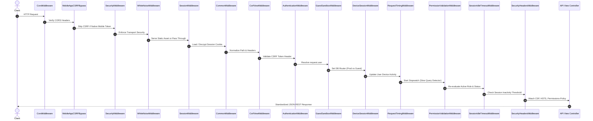
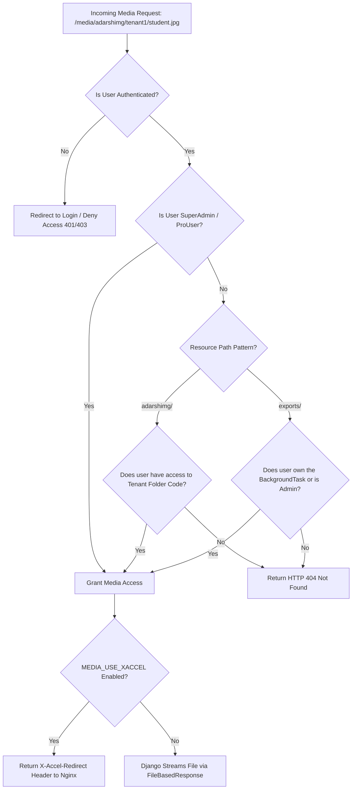

# 🛠️ CardFlow Backend Architecture Specification

> **Platform Version**: `v5.0.0` | **Engine**: Django 5.2.12 (Python 3.11+) | **Architecture**: Decoupled REST & Async Worker Architecture

---

## 📋 Table of Contents
1. [Architecture Overview](#1-architecture-overview)
2. [High-Level System Topology](#2-high-level-system-topology)
3. [Django App & Modular Breakdown](#3-django-app--modular-breakdown)
4. [Database & Multi-Tenancy Engine](#4-database--multi-tenancy-engine)
5. [Security, Middleware & Authentication](#5-security-middleware--authentication)
6. [Media Storage & Protected Access Control](#6-media-storage--protected-access-control)
7. [Async Workers, Task Queue & Real-time Layer](#7-async-workers-task-queue--real-time-layer)
8. [Export Pipelines & Image Processing Engine](#8-export-pipelines--image-processing-engine)
9. [API Route Map & Directory Structure](#9-api-route-map--directory-structure)

---

## 1. Architecture Overview

The **CardFlow Backend** is a production-grade, multi-tenant enterprise REST API and real-time backend engineered for high-volume ID card design, batch data ingestion, automated image processing, and precision PDF/Word printing pipelines.

### Core Architectural Principles
* **Decoupled RESTful Design**: Operates purely as a headless JSON API provider for the React 19 SPA, Expo Mobile Companion, and Desktop sync app. Zero Django template rendering for web views.
* **Granular Role-Based Multi-Tenancy**: Built-in support for isolated client organization schemas (`IDCardTable`) with client-level scope boundaries and strict role permissions (`Super Admin`, `Pro User`, `Client Admin`, `Operator`, `Assistant`, `Staff`).
* **Zero-Trust Media Protection**: Direct filesystem and Nginx `X-Accel-Redirect` protection ensuring raw card images, client photos, signatures, and export documents are strictly verified per-user and per-tenant before serving.
* **Hybrid Storage & Dual Database Routing**: Dynamic connection pooling with PostgreSQL in production, SQLite in dev, and isolated guest-mode sandbox routing (`GuestSandboxRouter`).
* **Asynchronous Offloading**: Background task queue (`BackgroundTask`) powered by Celery / ThreadPool workers for non-blocking PDF generation, Word document rendering, bulk ZIP extraction, and OpenCV face cropping.

---

## 2. High-Level System Topology

```mermaid
graph TD
    ClientSPA["React 19 Web SPA (Vite / Port 5173)"]
    MobileApp["React Native Expo Mobile Companion"]
    DesktopApp["Desktop Sync App Client"]
    
    Nginx["Nginx Reverse Proxy / Load Balancer"]
    WSGI["WSGI Server (Gunicorn / Daphne)"]
    ASGI["ASGI Server (Django Channels / WebSockets)"]
    
    subgraph Django Core Engine ["Django 5.2.12 Backend Core"]
        MiddlewareStack["Middleware Pipeline (Security, Auth, CSRF, Sandbox, Session, Audit)"]
        APIRouter["URL Dispatcher & REST API Views (/api/* & /panel/*)"]
        
        subgraph Modular Apps
            AppAccounts["accounts (Auth, Roles, Devices)"]
            AppClient["client (Tenants, Dynamic Schema Engine)"]
            AppCards["idcards (Card Data & State Machine)"]
            AppReprint["reprintcard (Reprint Queue & Pool)"]
            AppExports["exports (ReportLab PDF, Word, ZIP)"]
            AppMedia["mediafiles (OpenCV, Protected Media)"]
            AppMobile["mobile_api (Biometrics, Camera API)"]
            AppCore["core (Background Workers, Audit Logs)"]
        end
    end
    
    subgraph Data & Execution Layer
        PostgresDB[("PostgreSQL Database (Primary Data Store)")]
        SQLiteDev[("SQLite Sandbox DB (Guest / Local Dev)")]
        RedisCache[("Redis Cache & Channel Layer (OTP, Sessions, Rates)")]
        CeleryWorker["Background Workers (ThreadPool / Celery)"]
        Filesystem["Protected File Storage (/media/adarshimg, /exports)"]
    end

    ClientSPA -->|HTTP REST / JSON| Nginx
    MobileApp -->|HTTP REST / JSON| Nginx
    DesktopApp -->|HTTP REST / Sync| Nginx
    ClientSPA -->|WebSockets| ASGI

    Nginx -->|WSGI Pass| WSGI
    Nginx -->|ASGI Pass| ASGI
    WSGI --> MiddlewareStack
    MiddlewareStack --> APIRouter
    APIRouter --> AppAccounts
    APIRouter --> AppClient
    APIRouter --> AppCards
    APIRouter --> AppReprint
    APIRouter --> AppExports
    APIRouter --> AppMedia
    APIRouter --> AppMobile
    APIRouter --> AppCore

    AppCore --> CeleryWorker
    Django Core Engine --> PostgresDB
    Django Core Engine --> SQLiteDev
    Django Core Engine --> RedisCache
    AppExports --> Filesystem
    AppMedia --> Filesystem
    CeleryWorker --> Filesystem
```

---

## 3. Django App & Modular Breakdown

The backend is partitioned into discrete, domain-driven Django applications:

| Application | Primary Responsibility & Key Models |
|---|---|
| **`core`** | System infrastructure, middleware stack, global error handling, `BackgroundTask` model, `ActivityLog` model, health metrics (`/api/health/`), and database routers. |
| **`accounts`** | Custom User Model (`core.User`), authentication endpoints, session security, device tracking (`DeviceSessionMiddleware`), OTP generation, and RBAC role definitions. |
| **`client`** | Tenant management (`Client`), multi-organization separation, dynamic ID card schema builder (`IDCardTable`), client field customization, and custom field types. |
| **`idcards`** | Primary student/staff card data records (`IDCardData`), state-machine transition pipeline (`pending` ➔ `verified` ➔ `pool` ➔ `approved` ➔ `download`), dynamic cell values, and status tracking. |
| **`reprintcard`** | Dedicated replacement/lost card request queue (`ReprintRequest`, `ReprintCardData`), print pool batching, and isolated confirmation workflows. |
| **`exports`** | High-precision PDF grid generation engine (ReportLab, WeasyPrint), Word `.docx` section exporter, Excel/CSV bulk export services, and async background file generation. |
| **`mediafiles`** | Protected media delivery (`_protected_media_serve`), zero-trust authorization checks, OpenCV face auto-cropping, thumbnail generation, and ZIP archive image extraction. |
| **`mobile_api`** | Specialized endpoints for the React Native companion app: real-time optical camera biometric checks, directory search, and field photo capture. |
| **`desktop_app`** | Native desktop companion synchronization API, chunked file downloader, and token-authenticated desktop client bootstrap. |
| **`web_app`** | Public Web SPA endpoints, client setup wizards, dynamic schema fetchers, and public-facing REST services. |
| **`staff` / `operators` / `assistants`** | Role-specific workflow controllers, task assignments, staff operational logs, and field worker permissions. |
| **`stats`** | Telemetry dashboard analytics, system performance metrics, working client aggregations, and daily card production logs. |

---

## 4. Database & Multi-Tenancy Engine

### 4.1 Database Configuration & Connection Pooling
* **Production**: PostgreSQL configured via `DATABASE_URL` with `dj_database_url`. Persistent connection lifetime (`conn_max_age=600`) and proactive health probes (`conn_health_checks=True`).
* **Development & Automated Testing**: SQLite (`test_db.sqlite3` / `db.sqlite3`) with atomic request safety (`ATOMIC_REQUESTS=True`).

### 4.2 Dynamic Multi-Tenant Schema Engine (`IDCardTable`)
Unlike rigid database models, CardFlow allows client administrators to define custom schemas at runtime without executing database migrations:
* **Custom Field Definitions**: Supported field types include `Text`, `Number`, `Date`, `Dropdown/Select`, `Photo (Image)`, `Signature (Image)`, `QR Code`, and `Computed`.
* **Flexible Storage**: Data records store standard identity properties while housing dynamic custom schema attributes cleanly within structured JSON payload fields on `IDCardData`.

### 4.3 Guest Sandbox Dual-Database Router (`GuestSandboxRouter`)
CardFlow includes a non-intrusive demo sandbox environment. When an unauthenticated or demo user accesses the platform:
* `GuestSandboxMiddleware` detects the request state and sets thread-local context.
* `GuestSandboxRouter` routes all read/write operations seamlessly to an isolated SQLite sandbox database, preventing writes to the primary production database.

### 4.4 Compatibility Service & Primary ID Offset Engine (`CompatibilityService`)
To support unified client and staff user lookups across legacy API wrappers and mobile endpoints:
* **Offset Mapping**: `CompatibilityService` maps User IDs dynamically (`100,000+` offset for staff users, `200,000+` offset for client organizations).
* **Defensive Decoding**: `CompatibilityService.decode_id()` provides robust type safety, gracefully casting string inputs to integers before evaluating ID ranges.

---

## 5. Security, Middleware & Authentication

### 5.1 Sequential Middleware Pipeline Execution Order



### 5.2 Security Rules & Hardening Parameters
* **Authentication**: Session-based auth with HTTP-Only, SameSite=Lax, and Secure cookie enforcement (`SESSION_COOKIE_HTTPONLY=True`, `SESSION_COOKIE_SAMESITE='Lax'`).
* **Session Lifecycle**: 30-day sliding session expiration (`SESSION_COOKIE_AGE=2592000`) paired with configurable session idle timeouts (`SESSION_IDLE_TIMEOUT`).
* **Per-Request Permission Guard**: `PermissionValidationMiddleware` re-evaluates user permissions against database roles every `PERMISSION_REVALIDATION_INTERVAL` requests to instantly revoke compromised access.
* **Separation of CORS & CSRF**: Dedicated origins configured for cross-origin frontend SPA deployments (`http://localhost:5173`) with explicit `CSRF_TRUSTED_ORIGINS`.

### 5.3 Impersonation & Return-To-Admin Session Lifecycle
Administrative users can impersonate client and staff accounts for auditing and troubleshooting:
* **Start Impersonation (`POST /api/auth/impersonate/start/`)**: Stores `_impersonator_id` and `_impersonator_name` in the session, executes `login(request, target_user)`, and sets `is_impersonating=True`.
* **Stop Impersonation (`POST /api/auth/impersonate/stop/`)**: Retrieves `_impersonator_id`, clears session impersonation keys, resets thread-local sandbox DB routing via `GuestSandboxRouter.clear_guest_db()`, fetches the original user from the `'default'` database (`UserModel.objects.using('default').get(...)`), and seamlessly restores the administrative user session via `login()`.
* **Automated Verification**: Fully validated via `full_api_test.py` with 100% pass rate.

---

## 6. Media Storage & Protected Access Control

### 6.1 Zero-Trust Protected Media Pipeline (`_protected_media_serve`)
All sensitive images and documents (`/media/adarshimg/`, `/media/exports/`, `/media/clients_imgs/`, `/media/staff_imgs/`, `/media/temp/`) are denied direct public access.



---

## 7. Async Workers, Task Queue & Real-time Layer

### 7.1 Hybrid Async Task Processing Engine (`BackgroundTask`)
Heavy tasks (ReportLab PDF compilation, Word document generation, ZIP archive packing, OpenCV batch cropping) are offloaded asynchronously to avoid blocking HTTP request worker threads.
* **Task Tracker**: Operations store execution state in `core.models.BackgroundTask` with progress tracking (`0% ➔ 100%`), execution status (`PENDING`, `RUNNING`, `SUCCESS`, `FAILED`), and download file references (`result_path`).
* **Execution Options**:
  1. **ThreadPool Worker**: In-process background thread pool (`BACKGROUND_WORKER_MAX_WORKERS=2`) for zero-dependency deployments.
  2. **Celery Worker**: Redis-backed distributed task queue (`CELERY_BROKER_URL`) for multi-server production environments.

### 7.2 Django Channels & WebSockets
* **ASGI Architecture**: Configured in `config/asgi.application`.
* **Redis Channel Layer**: `channels_redis` handles event fanout across Gunicorn/Daphne cluster nodes.
* **Use Cases**: Real-time status updates for card verification pipelines, batch export progress bars, live client operational metrics, and mobile camera scan triggers.

---

## 8. Export Pipelines & Image Processing Engine

### 8.1 PDF Printing Engine (`ReportLab` & `WeasyPrint`)
* **Millimeter-Accurate Grid Layouts**: Renders multi-card PDF sheets tailored to standard CR80 ID card specs (85.6mm × 53.98mm).
* **Double-Sided Printing**: Aligns front and back card templates on alternating pages with mirror margins for dual-sided PVC card printers.

### 8.2 Word Exporter (`python-docx`)
* Renders print-ready Word documents featuring automated page breaks structured by `Class` and `Section` boundaries.

### 8.3 Automated OpenCV Face Cropper
* Standalone PyInstaller / FastAPI microservice and integrated Python module using Haar Cascades & DNN models to automatically locate human faces, adjust eye-level alignment, compress highlights, and crop images to 3:4 portrait ratios.

---

## 9. API Route Map & Directory Structure

### 9.1 Root API Endpoints Overview
* `/api/health/` — System health, database connectivity, and telemetry probe.
* `/api/web/` — Public SPA authentication, client bootstrap, and schema endpoints.
* `/api/mobile/` — Native Mobile Companion biometrics, optical camera, and student directory routes.
* `/api/desktop/` — Desktop synchronization client API.
* `/panel/auth/` — Control panel authentication, session management, and password management.
* `/panel/client/` — Multi-tenant organization manager and dynamic schema design lab.
* `/panel/work/` — ID card data grid operations, inline cell edits, and state transitions.
* `/panel/reprint/` — Reprint request queue, approval workflow, and reprint pool.
* `/panel/exports/` — Async export task triggers (PDF, Word, Excel, ZIP download).
* `/panel/images/` — Image upload handler, crop trigger, and thumbnail generator.

### 9.2 Backend Directory Structure
```
CardFlow/
├── config/                  # Django project configuration (settings.py, urls.py, wsgi.py, asgi.py)
├── core/                    # Core middleware, BackgroundTask, ActivityLog, DB routers, base models
├── accounts/                # Custom User model, session management, auth views, permissions
├── client/                  # Multi-tenant Client model, IDCardTable dynamic schema engine
├── idcards/                 # IDCardData model, card state machine, dynamic cell fields
├── reprintcard/             # ReprintRequest & ReprintCardData queues and workflows
├── exports/                 # ReportLab PDF, python-docx Word, Excel, and ZIP export pipelines
├── mediafiles/              # OpenCV face cropper, protected media server, thumbnail generator
├── mobile_api/              # REST endpoints for Expo React Native Companion App
├── desktop_app/             # Sync REST API endpoints for Desktop Client
├── web_app/                 # Public web REST API controllers
├── staff/                   # Staff management views & serializers
├── operators/               # Field operator task management views
├── assistants/              # Assistant role views & logic
└── stats/                   # Analytics dashboard data aggregation controllers
```

---
*Documentation generated for CardFlow Engine Architecture (`v5.0.0`).*
