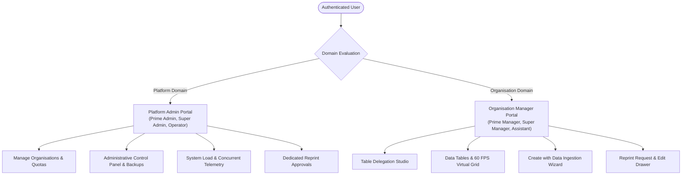
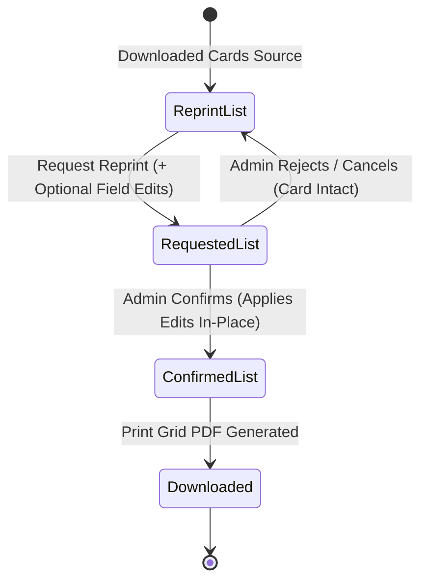

# Desktop Web Application & Portal Operations Guide

This document provides a comprehensive technical and operational guide for the **CardFlow Desktop Web Application** (`frontend/`). Engineered as a high-performance single-page application (SPA) with **React 19** and **Vite**, the portal delivers 60 FPS virtualized data grids, dynamic schema design labs, 3-step reprint lifecycle management, bulk image reupload pipelines, and administrative telemetry.

---

## 1. System Overview & UI Design Philosophy

### Technology Stack
- **Framework**: React 19 (SPA Architecture with functional components and modern hooks).
- **Build Tool**: Vite 8.1 (Sub-second HMR, tree-shaken production bundles).
- **Virtualization Engine**: TanStack Virtual (Renders 10,000+ card rows at 60 FPS with minimal DOM footprint).
- **Styling Architecture**: Custom CSS Design Tokens with CSS Variables (Fluid dark/light mode, glassmorphic floating panels, and smooth micro-animations).
- **Icons**: Lucide React (Crisp, modern SVG icons).
- **HTTP Client**: Centralized Axios instance with automatic CSRF management, JWT/Session tokens, and toast error interceptors.

### Visual Aesthetics & UX Standards
```text
┌──────────────────────────────────────────────────────────────────────────────┐
│  CardFlow Desktop Portal UI System                                           │
├──────────────────────────────────────────────────────────────────────────────┤
│  • Curated Color Palette: Tailored Indigo / Slate / Emerald / Amber themes   │
│  • Typography: Clean, modern sans-serif hierarchy (Inter / Outfit)           │
│  • Non-Destructive Actions: Confirmation modals with live diff previews      │
│  • Responsive Layouts: Tailored for Full HD (1080p), 2K, and 4K displays      │
│  • Floating Impersonation Bar: Collapsible, persistent admin context HUD     │
└──────────────────────────────────────────────────────────────────────────────┘
```

---

## 2. Authentication, Navigation & Role-Based UI

### 2.1 Multi-Tenant Two-Domain Interface
The portal dynamically adjusts view layouts and action buttons based on the authenticated user's role domain:



### 2.2 Floating Impersonation Bar
Super Admins and Prime Admins can securely impersonate any organization account for troubleshooting:
- **Small-Footprint Floating Bar**: Positioned cleanly at the top of the interface.
- **Controls**: Includes a **Minimize / Expand toggle** and an **Exit Impersonation** button that seamlessly returns the session to the original admin without losing state.

---

## 3. Core Feature Deep-Dives

### 3.1 Dynamic Table & Schema Studio (`/tables`)
The Schema Studio allows administrators to design dynamic tabular schemas on the fly without database migrations:
- **Field Types**: `text`, `number`, `date`, `select`, `image`, `signature`, `qr`, `barcode`.
- **Validation Rules**: Mark fields as `Required`, `Unique`, or `Display in Table`.
- **Case Preservation**: Data casing (upper, lower, title) is strictly respected across all spreadsheet ingestion and inline editing operations.

---

### 3.2 Spreadsheet & Word Ingestion Wizard ("Create with Data")
Located under the Tables menu, this guided wizard ingests records from spreadsheets and Word documents:
1. **Source File Support**: `.xlsx`, `.xls`, `.csv`, `.docx` (Word tables).
2. **Auto-Header Matching**: Automatically detects headers and suggests field mappings.
3. **Embedded Cell Photo Extraction**: Scans Excel worksheet drawings (`ws._images`) and Word inline drawings (`w:drawing`), automatically binding embedded student photos directly to student card records without requiring separate ZIP uploads.

---

### 3.3 High-Performance Virtual Data Grid (`IDCardTableView.jsx`)
The core workhorse of CardFlow, capable of handling 10,000+ records seamlessly:
- **TanStack Row Virtualization**: Only active viewport rows (~25 DOM nodes) are rendered in memory, ensuring ultra-smooth scrolling.
- **Inline Cell Editing**: Double-click or select to edit student fields directly in the table with immediate auto-save and audit tracking.
- **Multi-Selection & Batch Transitions**: Multi-select cards to transition across the lifecycle:
  $$\text{Pending} \longrightarrow \text{Verified} \longrightarrow \text{Pool} \longrightarrow \text{Approved} \longrightarrow \text{Download}$$
- **Soft Duplicate Scanner**: Real-time duplicate record detector that highlights potential duplicates without blocking operations or corrupting data.

---

### 3.4 Dedicated 3-Step Reprint Manager (`ReprintCardsManagerView.jsx`)
CardFlow features a dedicated reprint pipeline with an isolated 3-stage lifecycle:



#### The 3 Tab Views:
1. **Step 1: Reprint List (`reprint_list`)**:
   - Lists all downloaded cards deduplicated by `card.id`.
   - **Student Edit Modal**: Enables editing student details before submitting a request.
   - **Status Indicators**: Shows whether a card is currently pending review in the queue and displays its lifetime reprint count (*e.g., 2x Reprinted*).
2. **Step 2: Requested List (`request_list`)**:
   - Displays all pending reprint submissions with requester details, timestamps, and stated reasons (e.g. *Damaged*, *Lost*, *Name Correction*).
   - **Staged Changes Diff Modal**: Visual green/red diff comparison showing original vs staged values.
   - **Admin Reject / Cancel**: Cancels the request and returns the card to the available pool in the Reprint List without altering the original card.
   - **Admin Confirm**: Approves the reprint.
3. **Step 3: Confirmed List (`confirmed`)**:
   - **In-Place Mutation (No Duplication)**: Approved edits are applied directly to `IDCard.field_data` without creating duplicate card rows in the database.
   - **Sequential Reprint Badges**: Each confirmed reprint increments and displays its counter badge (*e.g., Reprint #1, Reprint #2*).
   - **Audit Tracking**: Logs confirming administrator and confirmation timestamp.

---

### 3.5 High-Speed Bulk Photo Reupload & OpenCV Face Crop
- **Drag-and-Drop ZIP Ingestion**: Upload zip archives containing thousands of student photos.
- **In-Memory Streaming Matcher (`UltraFastReuploadMatcher`)**: Matches photo filenames against student Roll Numbers, Names, or Card IDs in <400ms.
- **Embedded OpenCV Face Detection**: Server-side face detector crops and centers portraits to standard passport proportions (`35mm × 45mm` ratio) with color-coded confidence indicators.

---

### 3.6 Print & Sheet Generation Suite
- **Compact 300 DPI PDF Generation**: Pillow downsamples raw camera images to exact print resolutions, reducing PDF file sizes by 15x–20x (from ~200MB to ~10MB) while maintaining print-shop quality.
- **A4 Sheet Imposition Layouts**: Generates multi-up grids (8, 9, 10, or 12 cards per sheet) with configurable bleed margins, cut marks, and back-side alignment.
- **Word (.docx) Exporter**: Bundles tabular records with high-resolution photos scaled to physical XML dimensions (`1.9cm × 2.5cm`).
- **Lossless ZIP Streaming**: Streams full-resolution original photos using zero-CPU `ZIP_STORED` mode.

---

### 3.7 Administrative Control & Security Center (`ManagePanel.jsx`)
Super Admins and Platform Owners have access to advanced administrative controls:
- **Audit Activity Logs**: Inspect all platform operations with searchable filters. Securely clear logs with a mandatory **One-Time Verification Code** and automatic `.jsonl` backup archive generation.
- **Real-Time Email Engine & Retry Queue**: Inspect email delivery logs with an automatic exponential backoff retry worker loop.
- **System Load Telemetry**: Monitor CPU, RAM, database connections, and active concurrent user counts.
- **Database Backup Engine**: Initiate manual database snapshots and download combined `.zip` packages secured by dynamic security codes.

---

## 4. Keyboard Shortcuts & Operational Productivity

| Shortcut | Scope | Action |
| :--- | :--- | :--- |
| `Ctrl + F` / `Cmd + F` | Data Table | Focus global search input |
| `Escape` | Modals / Drawers | Dismiss current modal or edit drawer |
| `Ctrl + A` / `Cmd + A` | Data Table | Select all visible cards in current view |
| `Shift + Click` | Data Table | Range-select cards between two rows |
| `Enter` | Modal Input | Confirm primary modal submission |

---

## 5. Development, Build & Deployment

### Local Development Setup
```bash
# Navigate to frontend directory
cd frontend

# Install dependencies
npm install

# Launch Vite development server
npm run dev
```

### Production Build & Verification
```bash
# Compile optimized production bundle
npm run build

# Preview production build locally
npm run preview
```

### Environment Configuration (`frontend/.env`)
```env
VITE_API_BASE_URL=https://panel.adarshbhopal.in
VITE_ENABLE_ANALYTICS=false
```
