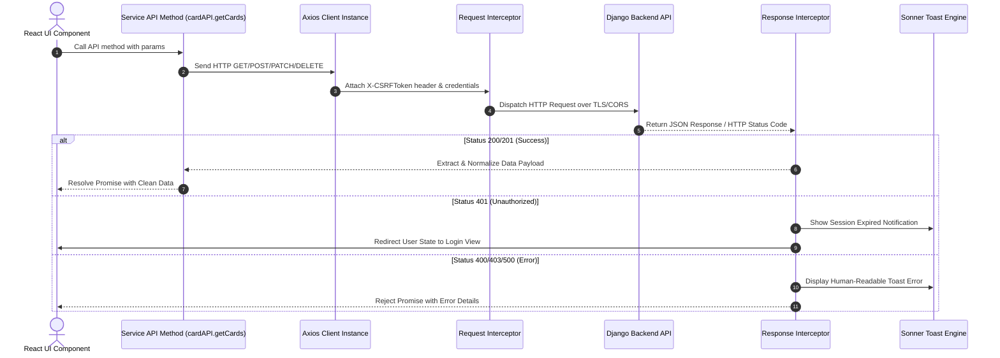

# 🎨 CardFlow Frontend Architecture Specification

> **Platform Version**: `v5.0.0` | **Core Engine**: React 19 Single Page Application (SPA) | **Bundler**: Vite 8 | **Styling**: Pure Vanilla CSS HSL Design System

---

## 📋 Table of Contents
1. [Architecture Overview](#1-architecture-overview)
2. [Component & View Hierarchy Topology](#2-component--view-hierarchy-topology)
3. [Design System & Vanilla CSS Engine](#3-design-system--vanilla-css-engine)
4. [State Management & Navigation Architecture](#4-state-management--navigation-architecture)
5. [API Service Layer & Axios Client](#5-api-service-layer--axios-client)
6. [Data Grid & Dynamic Schema Rendering](#6-data-grid--dynamic-schema-rendering)
7. [Pro Tools & Interactive Components](#7-pro-tools--interactive-components)
8. [Performance Optimizations](#8-performance-optimizations)
9. [Frontend Directory Structure](#9-frontend-directory-structure)

---

## 1. Architecture Overview

The **CardFlow Frontend** is a modern, high-performance React 19 Single Page Application (SPA) designed to deliver a high-density, desktop-grade user interface for managing ID card operations, multi-tenant schemas, real-time data grids, dynamic exports, and interactive image processing.

### Key Architectural Principles
* **Decoupled SPA Architecture**: 100% decoupled from server-side Django templates. Communicates exclusively via JSON REST APIs over HTTP/HTTPS and WebSockets.
* **Pure Vanilla CSS HSL Token System**: Built without heavy utility frameworks like Tailwind. Employs CSS custom properties with HSL color math, custom dark mode elevation layers, glassmorphism backdrop filters, and responsive micro-animations.
* **TanStack React Table v9 Integration**: High-density virtualized data grid with inline cell editing, dynamic column sorting, dynamic schema cell rendering, and bulk multi-select action bars.
* **Smooth Animation & UX**: Integrated with Lenis for smooth momentum scrolling, Framer Motion for modal/sidebar transitions, and Sonner for toast notifications.
* **Edge-Ready Deployment**: Configurable `VITE_API_BASE_URL` supporting independent deployment to static CDNs (Vercel, Netlify, Cloudflare Pages, S3/CloudFront).

---

## 2. Component & View Hierarchy Topology

```mermaid
graph TD
    AppEntry["src/main.jsx (React 19 Root & Lenis Scroll Setup)"]
    AppCore["src/App.jsx (Central State, Auth Provider & View Router)"]
    
    subgraph Global Services & Modals
        AxiosClient["src/services/api.js (Axios Client, CSRF, Sonner Toasts)"]
        GlobalSearchModal["GlobalSearchModal (Ctrl + K Command Palette)"]
        ConfirmDeleteModal["ConfirmDeleteModal (Destructive Actions Guard)"]
        OldVersionWarning["OldVersionWarningModal (Build Version Checker)"]
        SonnerToaster["Sonner Toaster (Toast Notifications Container)"]
    end

    subgraph App Shell Layout ("src/components/layout/")
        Shell["Shell Component (Main Shell Container)"]
        Sidebar["Sidebar Component (Collapsible Multi-Tenant Navigation)"]
        Header["Header Component (Tenant Selector, User Profile, Theme Toggle)"]
        Breadcrumbs["Breadcrumbs Component (Contextual Navigation Path)"]
        Footer["Footer Component (Telemetry & Build Badge)"]
    end

    subgraph Core View Modules
        DashView["dashboard/ (Operational Telemetry KPI Cards, Recharts Analytics)"]
        CardGridModule["idcard/ (TanStack Data Grid, Inline Edit, Status Pipelines)"]
        TenantModule["client/ (Multi-Tenant Manager, Dynamic Schema Design Lab)"]
        ReprintQueueModule["reprint/ (Dedicated Reprint Request Queue & Pool Manager)"]
        ProToolsModule["pro/ (OpenCV Interactive Cropper, 3D Lanyard Mockup Engine)"]
        PanelControlModule["panel/ (Task Progress Tracker, Audit Logs, Settings)"]
        AuthModule["auth/ (Login Form, Role-Based Route Locks)"]
    end

    AppEntry --> AppCore
    AppCore --> AxiosClient
    AppCore --> GlobalSearchModal
    AppCore --> ConfirmDeleteModal
    AppCore --> OldVersionWarning
    AppCore --> SonnerToaster
    
    AppCore --> Shell
    Shell --> Sidebar
    Shell --> Header
    Shell --> Breadcrumbs
    Shell --> Footer

    Shell --> DashView
    Shell --> CardGridModule
    Shell --> TenantModule
    Shell --> ReprintQueueModule
    Shell --> ProToolsModule
    Shell --> PanelControlModule
    Shell --> AuthModule
```

---

## 3. Design System & Vanilla CSS Engine

The design system is located in `src/index.css` (80+ KB of tokens and UI primitives) and built entirely on native CSS custom properties.

### 3.1 Design System Tokens & Color Palette
```css
:root {
  /* HSL Tailored Brand Colors */
  --primary-h: 220;
  --primary-s: 90%;
  --primary-l: 56%;
  --primary: hsl(var(--primary-h), var(--primary-s), var(--primary-l));
  
  /* Surface Elevation System */
  --bg-dark-0: #0b0f19;
  --bg-dark-1: #111827;
  --bg-dark-2: #1f2937;
  --bg-glass: rgba(17, 24, 39, 0.75);
  
  /* Status Colors */
  --status-pending: #f59e0b;
  --status-verified: #3b82f6;
  --status-approved: #10b981;
  --status-download: #8b5cf6;
  --status-reprint: #ef4444;
}
```

### 3.2 Key UI Features
* **Glassmorphism Backdrop Filters**: Uses `backdrop-filter: blur(12px)` for headers, sidebars, command palettes, and floating action bars.
* **Micro-Animations & Keyframes**: Native CSS `@keyframes` handle shimmer loading skeletons, pulse badges, modal scale transitions, and table row highlight fades.
* **Density Modes**: Supports normal and high-density table modes for managing thousands of student card records on desktop screens.

---

## 4. State Management & Navigation Architecture

### 4.1 Single-Page View-Based Routing
CardFlow uses an internal view state router in `App.jsx` instead of full page reloads:
* **Current View Context**: Managed via `activeView` state hook (e.g., `'dashboard'`, `'idcards'`, `'client'`, `'reprint'`, `'pro_cropper'`, `'pro_3d'`, `'activity_logs'`).
* **Role-Based View Locks**: Unauthenticated users are redirected to `'login'`. Client admins are restricted to their tenant boundary, while Super Admins can switch between multi-tenant scopes globally.

### 4.2 Optimistic UI Updates
To ensure instant responsiveness:
* Card status badge toggles (`pending ➔ verified ➔ pool ➔ approved`) immediately mutate local React state and update the DOM before awaiting the API confirmation.
* Inline data grid edits update cell values instantly, displaying a subtle saving indicator while dispatching back-end PATCH requests.

---

## 5. API Service Layer & Axios Client

All HTTP communication flows through a unified Axios instance defined in `src/services/api.js`.



### 5.1 Service Module Architecture
The service layer exposes organized domain namespaces:
* `authAPI`: `login()`, `logout()`, `getProfile()`, `verifyOTP()`
* `clientAPI`: `getClients()`, `createClient()`, `getSchema()`, `updateSchema()`
* `cardAPI`: `getCards()`, `updateCard()`, `bulkUpdateStatus()`, `uploadPhoto()`
* `reprintAPI`: `getReprintRequests()`, `approveReprint()`, `confirmReprint()`
* `exportAPI`: `triggerPDFExport()`, `triggerWordExport()`, `getTaskProgress()`
* `statsAPI`: `getDashboardStats()`, `getWorkingClients()`, `getDailyLogs()`

---

## 6. Data Grid & Dynamic Schema Rendering

The central workplace is the ID Card Data Grid component (`src/components/idcard/`):
* **TanStack React Table v9**: Renders dynamic columns according to the selected organization's schema (`IDCardTable`).
* **Dynamic Cell Editors**:
  * `Text` / `Number` ➔ Inline Input
  * `Dropdown` ➔ Select Dropdown
  * `Photo` / `Signature` ➔ Interactive Image Preview Modal with crop options
  * `Status` ➔ Color-coded state badge dropdown
* **Bulk Selection Action Bar**: Allows operators to select hundreds of records simultaneously to trigger bulk verification, pool assignment, PDF rendering, or ZIP exports.

---

## 7. Pro Tools & Interactive Components

### 7.1 OpenCV Face Cropper UI (`src/components/pro/FaceCropperModal.jsx`)
* Interactive canvas engine allowing operators to manually adjust face detection boxes, fine-tune aspect ratios, compress skin highlights, and preview cropped passport photos in real time.

### 7.2 3D Card Lanyard Preview Engine (`src/components/pro/ThreeDCardPreview.jsx`)
* Interactive CSS 3D matrix and Framer Motion transform engine that renders student ID cards on physical lanyards with perspective rotation and lighting reflections.

### 7.3 Bulk Ingestion Wizard (`src/components/pro/BulkIngestionWizard.jsx`)
* Multi-step wizard supporting simultaneous Excel/CSV data uploads and matching multi-image ZIP archives with real-time field mapping validation.

---

## 8. Performance Optimizations

1. **Virtualization**: Uses `@tanstack/react-virtual` for datasets exceeding 1,000+ records to keep DOM nodes light and scroll speeds at 60 FPS.
2. **Lazy Loading & Code Splitting**: Heavy modules (Recharts, 3D Mockup Engine, OpenCV Cropper) are loaded on demand to minimize initial bundle size.
3. **Smooth Scroll Isolation**: Lenis scroll engine runs on a RAF (RequestAnimationFrame) loop, bypassing standard browser scroll stutter.

---

## 9. Frontend Directory Structure

```
frontend/
├── index.html               # SPA Entry HTML Container
├── vite.config.js           # Vite configuration & proxy settings
├── package.json             # React 19 dependencies & scripts
└── src/
    ├── main.jsx             # React 19 Root entrypoint & Lenis scroll setup
    ├── App.jsx              # Central router, state provider & view manager
    ├── index.css            # Pure Vanilla CSS Design System (Tokens, HSL, Utilities)
    ├── App.css              # Structural layout & animation styles
    ├── services/
    │   └── api.js           # Unified Axios client with CSRF & Sonner error handling
    ├── utils/
    │   ├── constants.js     # System constants & status codes
    │   └── formatters.js    # Date, badge & byte formatters
    └── components/
        ├── auth/            # Login form & OTP modal components
        ├── client/          # Multi-tenant Organization Manager & Dynamic Schema Lab
        ├── common/          # Reusable UI primitives (Skeleton, ConfirmModal, Badge)
        ├── dashboard/       # Operational Telemetry KPI cards & Recharts analytics
        ├── idcard/          # TanStack Data Grid, cell editors & status pipelines
        ├── layout/          # Shell, Sidebar, Header, Breadcrumbs & Footer
        ├── panel/           # Control Panel settings, Task Progress & Audit Logs
        ├── pro/             # Interactive Face Cropper, 3D Mockup & Bulk Ingestion
        ├── reprint/         # Reprint Queue manager & approval workflows
        ├── settings/        # System & user settings panels
        ├── staff/           # Staff directory & role permissions UI
        └── tutorial/        # Onboarding interactive guides
```

---
*Documentation generated for CardFlow Frontend Architecture (`v5.0.0`).*
