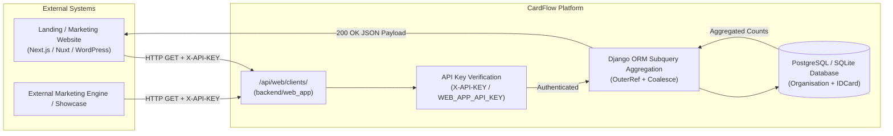

# Web App Integration & Public API Guide

This document provides a comprehensive technical guide for the **CardFlow Web App Integration module** (`backend/web_app`). It covers the architecture, server-to-server authentication, API endpoints, data aggregation pipelines, client integration code examples, performance, caching, and production security checklists.

---

## 1. Overview & Architecture

### Purpose
The **Web App** module provides a secure bridge between the internal CardFlow multi-tenant platform and public external systems, such as:
- **Public Landing & Marketing Websites** (e.g. `https://adarshbhopal.in` or custom front-ends).
- **Client & Institution Portfolios**: Dynamically displaying trusted school and organization partners with verified student card count telemetry.
- **Enterprise Status Showcases**: Demonstrating high-volume processing capacity to prospective clients.

### Architectural Diagram


---

## 2. Server-to-Server Security & Authentication

Access to the Web App API is strictly protected via a **Server-to-Server Pre-Shared API Key**.

### Authentication Parameters
| Method | Key Name | Example | Priority |
| :--- | :--- | :--- | :--- |
| **HTTP Header (Recommended)** | `X-API-KEY` | `X-API-KEY: your_production_secret_key_here` | Primary |
| **URL Query Parameter** | `api_key` | `https://api.cardflow.in/api/web/clients/?api_key=your_secret_key` | Fallback |

### Environment Configuration (`.env`)
Configure the secret key in the backend environment file:
```env
WEB_APP_API_KEY=adarsh_secure_production_key_98374928374982374
```

> [!IMPORTANT]
> If `WEB_APP_API_KEY` is not set in `.env`, the system defaults to a development fallback key for local staging. In production, always set a high-entropy 64-character random alphanumeric string.

---

## 3. API Reference

### `GET /api/web/clients/`
Retrieves the complete active directory of client organizations, their primary contact emails, and their total lifetime record counts aggregated across all data tables.

#### Request Headers
```http
GET /api/web/clients/ HTTP/1.1
Host: panel.adarshbhopal.in
X-API-KEY: your_production_secret_key_here
Accept: application/json
```

#### High-Performance Query Architecture
The view utilizes Django ORM subqueries with `OuterRef` and `Coalesce` to compute card counts at database level in a **single SQL query without N+1 overhead**:
```python
card_count_subquery = IDCard.objects.filter(
    table__organisation=OuterRef('pk')
).values('table__organisation').annotate(
    count=Count('id')
).values('count')

clients_queryset = Organisation.objects.select_related('user').annotate(
    total_records_count=Coalesce(Subquery(card_count_subquery, output_field=IntegerField()), 0)
).order_by('name')
```

#### Success Response (`200 OK`)
```json
{
  "success": true,
  "clients": [
    {
      "name": "Adarsh Higher Secondary School",
      "email": "principal@adarshbhopal.in",
      "total_records": 1850
    },
    {
      "name": "Delhi Public Academy",
      "email": "admin@dpa.edu.in",
      "total_records": 940
    },
    {
      "name": "St. Xavier's International College",
      "email": "records@stxaviers.org",
      "total_records": 3420
    }
  ]
}
```

#### Error Responses
- **`401 Unauthorized`**: Returned when the API Key is missing or invalid.
  ```json
  {
    "success": false,
    "message": "Unauthorized. A valid X-API-KEY is required."
  }
  ```
- **`500 Internal Server Error`**: Returned if an unhandled exception occurs on the database server.

---

## 4. Integration Code Examples

### 4.1 Next.js 14+ / React (App Router Server Component)
```typescript
// app/clients-showcase/page.tsx
import React from 'react';

interface ClientItem {
  name: string;
  email: string;
  total_records: number;
}

interface ApiResponse {
  success: boolean;
  clients: ClientItem[];
}

async function getClients(): Promise<ClientItem[]> {
  const res = await fetch(`${process.env.CARDFLOW_API_BASE_URL}/api/web/clients/`, {
    headers: {
      'X-API-KEY': process.env.CARDFLOW_WEB_APP_KEY || '',
      'Accept': 'application/json',
    },
    next: { revalidate: 3600 }, // Cache on Next.js edge for 1 hour
  });

  if (!res.ok) {
    throw new Error(`Failed to fetch client list: ${res.statusText}`);
  }

  const data: ApiResponse = await res.json();
  return data.clients;
}

export default async function ClientsShowcasePage() {
  const clients = await getClients();
  const totalCards = clients.reduce((acc, c) => acc + c.total_records, 0);

  return (
    <div className="max-w-6xl mx-auto py-12 px-4">
      <h1 className="text-3xl font-bold text-slate-900">Our Trusted Institutions</h1>
      <p className="text-slate-600 mb-8">
        Powering over <span className="font-semibold text-indigo-600">{totalCards.toLocaleString()}</span> student identity cards.
      </p>

      <div className="grid grid-cols-1 md:grid-cols-3 gap-6">
        {clients.map((client) => (
          <div key={client.name} className="p-6 bg-white border border-slate-200 rounded-xl shadow-sm hover:shadow-md transition">
            <h3 className="text-lg font-bold text-slate-800">{client.name}</h3>
            <p className="text-sm text-slate-500">{client.email || 'Verified Partner'}</p>
            <div className="mt-4 pt-4 border-t border-slate-100 flex items-center justify-between">
              <span className="text-xs text-slate-400">Total Cards</span>
              <span className="text-sm font-bold text-indigo-600">{client.total_records.toLocaleString()} cards</span>
            </div>
          </div>
        ))}
      </div>
    </div>
  );
}
```

### 4.2 Node.js (Express / Axios)
```javascript
const axios = require('axios');

async function fetchCardFlowStats() {
  try {
    const response = await axios.get('https://panel.adarshbhopal.in/api/web/clients/', {
      headers: {
        'X-API-KEY': process.env.WEB_APP_API_KEY,
      },
      timeout: 5000,
    });

    if (response.data.success) {
      console.log(`Successfully fetched ${response.data.clients.length} clients.`);
      return response.data.clients;
    }
  } catch (error) {
    console.error('Error contacting CardFlow Web API:', error.message);
    throw error;
  }
}
```

### 4.3 Python (httpx / requests)
```python
import httpx
import os

def fetch_clients_telemetry():
    api_url = "https://panel.adarshbhopal.in/api/web/clients/"
    headers = {
        "X-API-KEY": os.getenv("WEB_APP_API_KEY", "default_key"),
        "Accept": "application/json"
    }
    with httpx.Client(timeout=10.0) as client:
        resp = client.get(api_url, headers=headers)
        resp.raise_for_status()
        return resp.json()["clients"]
```

### 4.4 cURL (Terminal / Health Verification)
```bash
# Using Header
curl -s -H "X-API-KEY: adarsh_secure_production_key_98374928374982374" \
  https://panel.adarshbhopal.in/api/web/clients/ | jq .

# Using Query Param
curl -s "https://panel.adarshbhopal.in/api/web/clients/?api_key=adarsh_secure_production_key_98374928374982374" | jq .
```

---

## 5. Performance, Caching & Production Checklist

1. **Edge Caching**: Because client directories change infrequently, consumer frontends should cache this endpoint with a TTL of `300s` to `3600s` (5 to 60 minutes) or use stale-while-revalidate.
2. **CORS Configuration**: The endpoint supports cross-origin requests configured through `CORS_ALLOWED_ORIGINS` in `backend/config/settings.py`.
3. **Automated Unit Testing**:
   Run the dedicated test suite to verify integration integrity:
   ```bash
   python manage.py test web_app
   ```
   **Output**: `Ran 2 tests in 0.8s — OK`
